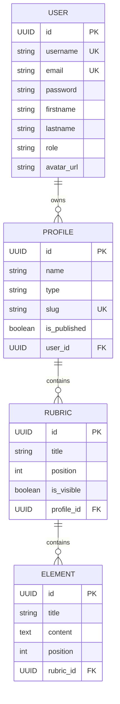

<div align="center">

# 🎨 Portfolio Builder

### Créez et partagez vos portfolios professionnels en quelques clics

[](https://spring.io/projects/spring-boot)
[](https://openjdk.org/)
[](https://www.mysql.com/)
[](LICENSE)

[🚀 Démo Live](http://projet1-srv1-vm-22110.sts-sio-caen.info) • [📖 Documentation](#-documentation) • [🛠️ Installation](#️-installation)

---


</div>

## 📋 Table des matières

- [✨ Fonctionnalités](#-fonctionnalités)
- [🏗️ Architecture](#️-architecture)
- [🛠️ Installation](#️-installation)
- [⚙️ Configuration](#️-configuration)
- [🚀 Déploiement](#-déploiement)
- [📖 Documentation](#-documentation)
- [🧪 Tests](#-tests)
- [👥 Comptes de démonstration](#-comptes-de-démonstration)
- [📝 License](#-license)

---

## ✨ Fonctionnalités

<table>
<tr>
<td width="50%">

### 👤 Gestion des utilisateurs
- ✅ Inscription avec validation
- ✅ Connexion sécurisée (Spring Security)
- ✅ Gestion des rôles (USER / ADMIN)
- ✅ Upload de photo de profil
- ✅ Modification du compte

</td>
<td width="50%">

### 📁 Gestion des profils
- ✅ Création de profils multiples (CV, Portfolio)
- ✅ Publication / Dépublication
- ✅ URL publique unique
- ✅ Prévisualisation avant publication

</td>
</tr>
<tr>
<td width="50%">

### 📝 Rubriques & Éléments
- ✅ CRUD complet des rubriques
- ✅ Gestion des éléments par rubrique
- ✅ Réorganisation par position
- ✅ Visibilité configurable

</td>
<td width="50%">

### 🔒 Sécurité & Administration
- ✅ Authentification BCrypt
- ✅ Protection des routes par rôles
- ✅ Page d'erreur 404 personnalisée
- ✅ Panel d'administration

</td>
</tr>
</table>

---

## 🏗️ Architecture

```
📦 portfolio-builder
├── 📂 src/main/java/alt/portfolio/builder
│   ├── 📂 application          # Advice, Exceptions
│   ├── 📂 config               # SecurityConfig, WebConfig
│   ├── 📂 controllers          # Spring MVC Controllers
│   ├── 📂 entities             # JPA Entities
│   ├── 📂 repositories         # Spring Data JPA
│   └── 📂 services             # Business Logic
├── 📂 src/main/resources
│   ├── 📂 templates            # Mustache Templates
│   ├── 📂 static               # CSS, JS, Images
│   └── 📄 application.properties
└── 📄 pom.xml
```

### 🔧 Stack Technique

| Composant | Technologie |
|-----------|-------------|
| **Backend** | Spring Boot 3.5.13, Spring MVC, Spring Data JPA, Spring Security |
| **Frontend** | Mustache, HTML5, CSS3, Semantic UI, JavaScript |
| **Base de données** | MySQL 8.0 (dev) / MariaDB 10.5 (prod) |
| **Build** | Maven 3.9+ |
| **Serveur** | Tomcat embarqué |

### 📊 Modèle de données



---

## 🛠️ Installation

### Prérequis

- ☕ **Java 17+** (recommandé : Java 21)
- 📦 **Maven 3.9+**
- 🐬 **MySQL 8.0+** ou **MariaDB 10.5+**
- 🔧 **Git**

### Installation rapide

```bash
# 1. Cloner le repository
git clone https://github.com/EstelleBihel/Portfolio-builder.git
cd Portfolio-builder

# 2. Créer la base de données
mysql -u root -p -e "CREATE DATABASE portfolio CHARACTER SET utf8mb4 COLLATE utf8mb4_unicode_ci;"
mysql -u root -p -e "CREATE USER 'portfolio'@'localhost' IDENTIFIED BY 'VotreMotDePasse';"
mysql -u root -p -e "GRANT ALL PRIVILEGES ON portfolio.* TO 'portfolio'@'localhost';"

# 3. Configurer l'application (voir section Configuration)

# 4. Lancer l'application
./mvnw spring-boot:run
```

L'application sera accessible sur **http://localhost:8080**

---

## ⚙️ Configuration

Créez ou modifiez le fichier `src/main/resources/application.properties` :

```properties
# Base de données
spring.datasource.url=jdbc:mysql://localhost:3306/portfolio
spring.datasource.username=portfolio
spring.datasource.password=VotreMotDePasse
spring.datasource.driver-class-name=com.mysql.cj.jdbc.Driver

# JPA / Hibernate
spring.jpa.hibernate.ddl-auto=update
spring.jpa.show-sql=false
spring.jpa.properties.hibernate.dialect=org.hibernate.dialect.MySQLDialect

# Mustache
spring.mustache.suffix=.html

# Serveur
server.port=8080

# Upload fichiers
spring.servlet.multipart.max-file-size=5MB
spring.servlet.multipart.max-request-size=5MB
```

---

## 🚀 Déploiement

### Compilation

```bash
# Générer le JAR exécutable
./mvnw clean package -DskipTests

# Le JAR est créé dans target/
ls target/*.jar
```

### Déploiement sur serveur

```bash
# Copier le JAR sur le serveur
scp target/portfolio-builder-*.jar user@serveur:/opt/portfolio-builder/

# Sur le serveur
cd /opt/portfolio-builder
java -jar portfolio-builder-*.jar &
```

### Service systemd (optionnel)

```ini
# /etc/systemd/system/portfolio-builder.service
[Unit]
Description=Portfolio Builder Application
After=network.target mysql.service

[Service]
Type=simple
User=portfolio
WorkingDirectory=/opt/portfolio-builder
ExecStart=/usr/bin/java -jar portfolio-builder.jar
Restart=always

[Install]
WantedBy=multi-user.target
```

---

## 👥 Comptes de démonstration

| Rôle | Username | Email | Mot de passe |
|------|----------|-------|--------------|
| 👑 **Admin** | `admin` | admin@portfolio.fr | `Admin123!` |
| 👤 **User** | `user` | user@portfolio.fr | `User123!` |

> 🔗 **Démo live** : [http://projet1-srv1-vm-22110.sts-sio-caen.info](http://projet1-srv1-vm-22110.sts-sio-caen.info)

---

## 📖 Documentation

### API Endpoints

| Méthode | Endpoint | Description | Auth |
|---------|----------|-------------|------|
| `GET` | `/` | Page d'accueil | ❌ |
| `GET` | `/login` | Page de connexion | ❌ |
| `GET` | `/users/register` | Inscription | ❌ |
| `GET` | `/dashboard` | Dashboard utilisateur | ✅ USER |
| `GET` | `/profiles` | Liste des profils | ✅ USER |
| `GET` | `/profiles/{id}` | Détail d'un profil | ✅ USER |
| `GET` | `/p/{slug}` | Profil public | ❌ |
| `GET` | `/users` | Liste des utilisateurs | ✅ ADMIN |

### Structure des EPICs

| EPIC | Description | User Stories |
|------|-------------|--------------|
| **EPIC 0** | Pages communes | US-000 |
| **EPIC 1** | Gestion utilisateurs | US-001 à US-005 |
| **EPIC 2** | Gestion des profils | US-006 à US-011 |
| **EPIC 3** | Rubriques & éléments | US-012 à US-020 |
| **EPIC 4** | Publication & partage | US-021 à US-027 |
| **EPIC 5** | Personnalisation | US-028 à US-030 |

---

## 🧪 Tests

```bash
# Exécuter tous les tests
./mvnw test

# Tests avec couverture
./mvnw test jacoco:report
```

---

## 📁 Scripts SQL

Le script de création de la base de données est disponible dans le dossier `/sql` :

```bash
mysql -u portfolio -p portfolio < sql/schema.sql
```

---

## 🤝 Contribution

1. Fork le projet
2. Créer une branche feature (`git checkout -b feature/AmazingFeature`)
3. Commit les changements (`git commit -m 'Add AmazingFeature'`)
4. Push sur la branche (`git push origin feature/AmazingFeature`)
5. Ouvrir une Pull Request

---

## 📝 License

Ce projet est réalisé dans le cadre du **BTS SIO SLAM** - Session 2026.

Distribué sous la licence MIT. Voir `LICENSE` pour plus d'informations.

---

## 👩‍💻 Auteur

**Estelle BIHEL**

- 🎓 BTS SIO SLAM - CaenSup
- 📧 estelle.bihel@sts-sio-caen.info
- 🔗 [GitHub](https://github.com/EstelleBihel)

---

<div align="center">

**⭐ Si ce projet vous a été utile, n'hésitez pas à lui donner une étoile !**

Made with ❤️ and ☕ in Normandie

</div>
